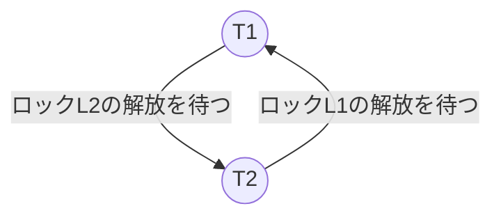

## はじめに
データベースシステムにおける同時実行制御（Concurrency Control）は、複数のトランザクションが同時にデーターベースにアクセスする際に、データの整合性を保ちながら最大限の並行性を実現する仕組みです。
トランザクションの持つACID特性のうち、C（Consistency, 一貫性）とI（Isolation, 分離性）を保証しています。
そこで、本記事では同時実行制御の全体像を整理していきたいと思います（ほぼ備忘録に近いです）。

現在のデータベースシステムでは単純なロックベースの制御から、マルチバージョン制御、さらには楽観的制御まで多様なアプローチが採用されています。これらの技術を理解することは、高性能なデータベースアプリケーションの設計はもちろん、大規模なデータを扱う基盤設計を行う際にも必要な知識だと個人的に思います。

:::message
トランザクションマネージャをはじめ、ストレージエンジンの仕組みを絶賛勉強中なので齟齬などがあった場合はこっそり教えていただけると泣いて喜びます！！
:::

## 前提知識
### 直列化可能性（Serializability）
Serializabilityは同時実効制御において正当性を保証する仕組みです。
トランザクションの並行実行結果が、何らかの順次実行と等価である場合、その実行は直列化可能であると定義されます。
また、トランザクションが完全に独立し、インターリーブなし（あえて不連続）で実行するスケージュールのことを、シリアルスケジュールといいます。

形式的定義：
```markdown
スケジュールSが直列化可能である ⟺ 特定のシリアルスケジュールS'が存在して、SとS'が完全に等価である
```

直列化可能性には等価の定義によってその種類が様々存在し、その中でも主要な２つを紹介します：

1. ビュー直列化可能性（View Serializability）
    
    スケジュールSがビュー直列可能であるとは、ある直列スケジュールS’が存在し、SとS'がビュー等価の時ことをいいます。
    
    また、スケジュールSとS'がビュー等価であるとは以下を満たすことをいいます：

    ```markdown
    1. 最終的な書き込みの集合が等しい(F(S)=F(S'))
    2. スケジュールS(あるいはS')のステップsが初期読み込みか、それに先行するステップの書き込み結果を読んでいるなら、スケジュールS'(あるいはS')でも同じである
    ```

    しかしながらこの問題はNP完全であるので、多項式時間で解くための仕組みが２の相反直列化可能性になります。

2. 相反直列化可能性（Conflict Serializability）
    
    スケジュールSが相反直列可能であるとは、ある直列スケジュールS’が存在し、SとS'が相反等価の時ことをいいます。

    また、スケジュールSとS'が相反等価であるとは以下を満たすことをいいます：

    ```markdown
    相反している全ての2つのステップの順番が、スケジュールSとS'で同一である
    ```

    つまり、相反する操作（同一データに対するread-write、write-write、write-read）の順序が保持されるという意味になります。

    また、トランザクションをノードとし、あるデータに対してのread-write/write-write/write-readという操作をエッジとしたときにできる有向グラフに閉路（サイクル）が存在しない場合に保証されます（＝ビュー直列化可能）。

    この相反直列化可能性を求めるアルゴリズムは多項式時間の計算量で済むことがわかっています。

ちなみに１より２の方が制約が強くなっており、相反直列可能であればビュー直列可能であるという十分条件が成立します（逆は成り立ちません）。

### 異常(Anomaly)
データの競合によって発生する主要な異常（Anomaly）について整理します。

まずは、readの際に発生するAnomalyです：

1. ダーティリード（Dirty Read）

    これは、他のトランザクションのまだコミットされていない変更をトランザクションが読み取るというAnomalyです。

    例えば、トランザクションT1がある値xを更新し、これがコミットされる前にトランザクションT2がその更新された値を読み取ったとします。そこで、T1がロールバックしてしまい、T2はコミットされていない値にアクセスしたということになり、これがダーティリードとなります。

2. ノンリピータブルリード（Non-repeatable Read）

    別名、ファジーリードとも呼ばれ、トランザクションが同じ行へ問い合わせを2回行い、異なる結果を得るというAnomalyです。

    例えば、トランザクションT1がある行xを読み取り、次にトランザクションT2がその行を更新しコミットした場合に、T1がその実行を終了する前にxを読み取ると違う値が取得されるというものです。

3. ファントムリード（Phantom Read）

    これは、トランザクションが同じ行のセットを2度要求し、異なる結果を受け取るというAnomalyです。

    ノンリピータブルリードと類似していますが対象が範囲に対するクエリになるという点で違いがあります。

次に、writeの際に発生するAnomalyです：

1. ロストアップデート（Lost Update）

    これは、2つのトランザクションT1とT2があった際に、両方のコミットが許容され、ある値に対するT1の更新がT2の結果で上書きされて、T1による更新が失われるというAnomalyです。

2. ダーティライト（Dirty Write）

    これは、あるトランザクションがダーティリードをして、それを変更して保存するというAnomalyです。

3. ライトスキュー（Write Skew）

    これは、必要とされている要件を個々のトランザクションは遵守しているが、その組み合わせがこれらの要件を満たさなくなる場合に発生するAnomalyです。

    例えば、xとyという値が存在し、初期状態がx=50、y=50とします。制約として、`x + y >= 0`が成立する必要があるとします。
    そこで、トランザクションT1がx=50からx=-50に更新したとします（y=50を読み取り済み）。
    さらに、トランザクションT2がy=50からy=-50に更新したとします（x=50を読み取り済み）。
    2つのトランザクションそれぞれは制約を満たしていますが、結果的にx=-50、y=-50となり、制約に違反しています。

### トランザクション分離レベル
トランザクション処理用途のデータベースシステムでは主に4つの分離レベルが存在し、それぞれのレベルで許容されるAnomalyがあります。

| 分離レベル | ダーティリード | ノンリピータブルリード |　ファントムリード |
| :----: | :----: | :----: | :----: |
| READ UNCOMMITTED | 許容 | 許容 | 許容 |
| READ COMMITTED | 防止 | 許容 | 許容 |
| REPEATABLE READ | 防止 | 防止 | 許容 |
| SERIALIZABILITY | 防止 | 防止 | 防止 |

多くのDBMSではREAD COMMITTEDがデフォルト設定になっている場合がほとんどです。
これは効率化のためであり、データの一貫性が完全に保証されていないということは開発を行う上で意識すべきですね。

また、データベースの中には**スナップショット分離(Snapshot Isolation, SI )**　を使用するものがあります。
各トランザクションは開始時点のデータベースのスナップショットを参照します。
ライトスキューは防げませんが、実用的な性能を実現していることから、PostgreSQLのREPEATABLE READやSQL ServerのSNAPSHOTがこれに相当します。

ちなみに、国産のオープンソースRDBである、Tsurugiは「SERIALIZABILITY以外の一貫性は提供しない」と明言しています。

## 悲観的同時実行制御（Pessimistic Concurrency Control, PCC）

PCCは、トランザクションの競合が発生することを前提として、それらの実行をブロックまたは、中断します。

タイムスタンプによる順序付けというロックフリーな手法も存在するのですが、ここではロックベースの同時実行制御を紹介します。

### 2相ロック（2 Phase Locking, 2PL）

最も広く普及しているロックベースの技術です。
基本原理は以下に示す通りです：

```markdown
1. 拡張フェーズ：ロックを拡張するのみ
2. 縮退フェーズ：ロックを解放するのみ
```

この2つのフェーズが重複しないことで競合直列化可能性を保証します。

しかしながら、トランザクションはデータベースオブジェクトに対するロックの獲得を試みて、ロックがすぐに獲得できない場合、トランザクションはそのロックが解放されるまで待機しないといけません。
そこで、例えば、2つのトランザクションが実行を進めるために必要なロックの解放を試みている間に、それぞれが保持しているロックが解放されるのをお互いに待機しなければならないという状況が発生する可能性があり、この状況を**デッドロック**といいます。



デッドロックの検出にあたっては**待機グラフ（Wait-for Graph）** が使用されます。これはトランザクションをノードとし、トランザクション間のどのロックに対して待機しているかの依存関係をエッジとして有向グラフを作成し、サイクルを見つけることでデッドロックを検出するという方法です。

また検出した後に回避するためのアルゴリズムとして以下が提案さています：

1. Wait-Die：古いトランザクションは待機、新しいトランザクションは中止

2. Wound-Wait：古いトランザクションは若いトランザクションを中止。自身のトランザクションのタイムスタンプが若い場合は待機

いずれもトランザクションマネージャがトランザクションのタイムスタンプを用いて優先順位を決定付けしています。

## マルチバージョン同時実行制御（Multiversion Concurrency Control, MVCC）

MVCCは、データの複数バージョンを保持することで読み取り操作をブロックせずに一貫性を保つ手法です。

近年のデータベースではMVCCが主流みたいです（ex. Oracle, Tsurugi, etc...）

基本概念として、各データ項目に対して複数のバージョンを保持します。
つまり、データを更新する場合に、上書きではなくデータを新規に追加し、既存のデータは古いバージョンとして残すことにしています。
各バージョンにはタイムスタンプまたはトランザクションID（単調増加する整数）が付与され、readの際に適切なバージョンを選択することになります。

実装する上で最も簡単な方法は、時刻印方式を拡張した多板時刻印方式（Multiversion timestamp ordering, MVTO）です。

MVCCの利点は以下の通りです：

```markdown
・ 読み取り専用トランザクションはロック不要
・ 長時間実行トランザクションがシステム全体をブロックしない
・ 高い並行性を実現
```

しかし、近年のOLTPとOLAPが混在するワークロードであるHTAP（Hybrid On-Line Transactional Analytical Processing）では、OLAPで大量のデータを読み出ている間に、OLTPによって高頻度にトランザクションから書き込みが行われることで上書きによる競合が発生しやすくなることから、如何にAbort/Waitによる整合性保証を効率よく行うかが問題になっています。

## 楽観的同時実行制御（Optimistic Concurrency Control, OCC）

OCCは、PCCとは対照的に、トランザクションの競合が稀であることを前提として、実行時は制約を設けずに、コミット時に検証を行う手法です。

最近GAになった[Amazon Aurora DSQL](https://aws.amazon.com/jp/blogs/news/concurrency-control-in-amazon-aurora-dsql/)がこの技術を採用しているみたいです（PostgreSQLのREPEATABLE READ 分離レベルに相当するスナップショット分離をサポートしているみたい）。

トランザクションのざっくりとした実行手順を以下に示します：

```markdown
1. 読み出しフェーズ：制約なしでデータを読み書きする
2. 確認フェーズ：他のトランザクションと不整合を起こさないかチェック
3. 書き込みフェーズ：確認フェーズのパス後、一時領域の書き込みデータをデータベースに反映
```

## まとめ

今回は数理的な証明を省いて、文章ベースでデータベースシステムにおける核心技術ともいえる同時実行制御について整理しました。

同時実行制御について全くわからない状態からここまで理解できるようになったのは、O'Reillyが出している「詳説 データベース ― ストレージエンジンと分散データシステムの仕組み」という本のおかげでした（実際にこの記事も構成も本の内容を参考にさせてもらっています。）

今後は分散データベースにおける一貫性保証などに関してもリサーチしていくとともに、トランザクション以外のデータベースの内部構造に関しても深掘りしていく予定です。

## 参考文献
- [「詳説 データベース ― ストレージエンジンと分散データシステムの仕組み」, Alex Petrov、小林 隆浩、成田 昇司, O'Reilly Japan](https://www.amazon.co.jp/%E8%A9%B3%E8%AA%AC-%E3%83%87%E3%83%BC%E3%82%BF%E3%83%99%E3%83%BC%E3%82%B9-%E2%80%95%E3%82%B9%E3%83%88%E3%83%AC%E3%83%BC%E3%82%B8%E3%82%A8%E3%83%B3%E3%82%B8%E3%83%B3%E3%81%A8%E5%88%86%E6%95%A3%E3%83%87%E3%83%BC%E3%82%BF%E3%82%B7%E3%82%B9%E3%83%86%E3%83%A0%E3%81%AE%E4%BB%95%E7%B5%84%E3%81%BF-Alex-Petrov/dp/4873119545)
- [「次世代高速オープンソースRDB Tsurugi」, 神林飛林 他, 日経BP](https://www.amazon.co.jp/%E6%AC%A1%E4%B8%96%E4%BB%A3%E9%AB%98%E9%80%9F%E3%82%AA%E3%83%BC%E3%83%97%E3%83%B3%E3%82%BD%E3%83%BC%E3%82%B9RDB-Tsurugi-%E7%A5%9E%E6%9E%97-%E9%A3%9B%E5%BF%97/dp/4296203231)
- [「リレーショナルデータベース入門\[第3版\]」, 増永良文, サイエンス社](https://www.amazon.co.jp/%E3%83%AA%E3%83%AC%E3%83%BC%E3%82%B7%E3%83%A7%E3%83%8A%E3%83%AB%E3%83%87%E3%83%BC%E3%82%BF%E3%83%99%E3%83%BC%E3%82%B9%E5%85%A5%E9%96%80%E2%80%95%E3%83%87%E3%83%BC%E3%82%BF%E3%83%A2%E3%83%87%E3%83%AB%E3%83%BBSQL%E3%83%BB%E7%AE%A1%E7%90%86%E3%82%B7%E3%82%B9%E3%83%86%E3%83%A0%E3%83%BBNoSQL-Information-Computing-%E5%A2%97%E6%B0%B8-%E8%89%AF%E6%96%87/dp/4781913903)
